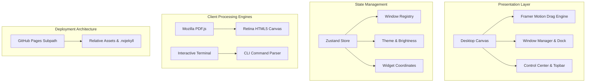

<div align="center">

# macOS Web Portfolio

**Interactive Personal Portfolio & Systems Research Environment**  
*Crafted for Yash Rana — Systems Security Researcher & M.Tech Data Science Scholar at IIIT Una*

[](https://yashrana738.github.io/portfolios/)
[](LICENSE)
[](https://github.com/YashRana738)
[](https://yashrana738.github.io/portfolios/)

<br />

<a href="https://yashrana738.github.io/portfolios/">
  
</a>

<br /><br />

[**Explore Live Environment →**](https://yashrana738.github.io/portfolios/)

</div>

---

## 🧭 Overview

An interactive, high-fidelity web operating system inspired by **macOS Sequoia**, designed to showcase research projects, engineering utilities, and academic background. 

Rather than a conventional static portfolio, this platform provides a tactile desktop workspace with multi-window management, persistent state orchestration, terminal emulation, native document reading, and system utilities.

### Key Architectural Pillars
- **Zero Framework Slop**: Grounded directly in verified engineering systems, research publications, and real-world tools.
- **In-Webpage Document Decoding**: Integrated Mozilla PDF.js engine rendering documents onto high-DPI HTML5 canvases without relying on native browser PDF plugins.
- **Authentic macOS Aesthetics**: Native boot animation, lockscreen authentication, translucent frosted glass panels (`backdrop-filter: blur(60px)`), and a responsive 3-column desktop widget grid.
- **Zero Native Backend Dependency**: 100% client-side, statically deployable to GitHub Pages with relative subpath routing.

---

## ⚡ Core Features

### 1. In-Webpage HTML5 Canvas PDF Reader
- Powered by **Mozilla PDF.js** with asynchronous worker decoding.
- Scaled dynamically using `window.devicePixelRatio` for retina vector typography.
- Window controls featuring page indicator badges, zoom modifiers, two-page navigation, and a direct download trigger.

### 2. Apple Mail Compose Application
- Authentic macOS Sequoia Mail client wired to the Mail dock icon and contact actions.
- Features recipient capsule pill tokens (`To: Yash Rana <yashrana738@gmail.com>`), sender name inputs, and subject formatting.
- One-click compose presets (`👋 Say Hello`, `🤝 Collaboration`, `💼 Opportunity`).
- Dual action handlers: instant clipboard copy with toast notifications, or direct compilation into pre-filled `mailto:` client links.

### 3. Native macOS Boot Sequence & Lockscreen
- Inlined, zero-flash SVG boot loader featuring official Apple silhouette geometry and easing progress animation.
- Functional macOS Lockscreen displaying live clock/date, battery indicator, user profile avatar, and interactive unlock flow.

### 4. Responsive 3-Column Desktop Grid
- Balanced multi-column canvas spreading identity, skills, repositories, and featured projects uniformly.
- Strict height caps (`< 380px`) guaranteeing clearance above the macOS dock on all screen sizes, from 768p laptops to 4K displays.
- Full Framer Motion drag gestures allowing free repositioning across the desktop canvas.

### 5. Interactive System Applications
- **Terminal**: UNIX shell environment with built-in commands (`neofetch`, `skills`, `projects`, `resume`, `github`, `clear`).
- **System Settings**: macOS Apple ID account hub displaying hardware metrics, network state, and research profile.
- **Photos & Finder**: File explorer navigating virtual directory trees with image and document previews.
- **Notes & Safari**: Dedicated productivity and browsing windows with external window pop-out capability.
- **4K Dynamic Wallpapers**: Dual-mode Sonoma landscape pair adapting automatically across light and dark system appearances.

---

## 🔬 Featured Systems & Research Projects

| Project | Domain | Architecture / Highlights |
| :--- | :--- | :--- |
| [**AnyLM (Local RAG)**](https://github.com/YashRana738) | Edge AI / Vector Retrieval | Privacy-preserving on-device Retrieval-Augmented Generation assistant leveraging FAISS vector indexing, quantized local LLMs, and multi-document chunking. |
| [**MountDroid**](https://github.com/YashRana738/MountDroid) | Linux USB Gadgets / Kernel | System utility utilizing the Linux USB Gadget API (`ConfigFS` / `g_mass_storage`) to emulate physical USB storage drives and boot live ISOs natively from Android devices. |
| [**App-Patcher**](https://github.com/YashRana738) | Systems Security / Smali | Automated bytecode reverse engineering pipeline designed for DEX decompilation, AST bytecode analysis, Smali patching, and automated APK alignment and signing. |
| [**PowerRate**](https://github.com/YashRana738/PowerRate) | Display Automation / Utilities | Windows background daemon automating dynamic display refresh rate switching based on power source and application focus to maximize battery efficiency. |

---

## 🛠 Tech Stack & Architecture



- **Core Framework**: React 18, TypeScript, Vite
- **State Management**: Zustand (lightweight reactive state store)
- **Animation & Physics**: Framer Motion
- **Styling**: Tailwind CSS, CSS Custom Properties, Frosted Glass Filters
- **Document Rendering**: Mozilla PDF.js (`pdf.min.js`, `pdf.worker.min.js`)
- **Icons**: Lucide Icons
- **Deployment Target**: GitHub Pages (Static HTML/JS/CSS, Zero Backend)

---

## 📂 Repository Structure

```plaintext
portfolios/
├── index.html                   # Entry point, preloads, boot animation, metadata
├── files.json                   # Virtual macOS file system index
├── wallpaper.jpg                # 4K macOS Sonoma dark wallpaper (3840x3840)
├── wallpaper-light.jpg          # 4K macOS Sonoma light wallpaper (3840x3840)
├── favicon.svg                  # Adaptive vector Apple silhouette icon
├── 404.html                     # Custom macOS recovery redirect page
├── .nojekyll                    # Disables Jekyll processing for raw static assets
├── Files/                       # Virtual filesystem documents
│   ├── About Me.txt             # Academic background summary
│   ├── README.txt               # In-system explorer guide
│   ├── Yash_Rana_Resume_1.pdf   # Complete academic and research CV
│   └── Projects/                # Presentation slides and research docs
└── assets/                      # Production application bundles & engines
    ├── index-v2.js              # Application bundle (Zustand store, macOS apps)
    ├── index-BBK2_mI4.css       # Tailwind utility stylesheet
    ├── profile.jpg              # High-DPI retina profile portrait
    └── pdfjs/                   # Mozilla PDF.js client engine & worker
        ├── pdf.min.js
        └── pdf.worker.min.js
```

---

## 🚀 Local Development

To run or test the environment locally without an internet connection:

### Prerequisites
Any static HTTP server or modern web environment.

### Option 1: Python Built-in Server
```bash
# Navigate to the repository directory
cd portfolios

# Launch static server on port 8000
python -m http.server 8000
```
Open [http://localhost:8000](http://localhost:8000) in your browser.

### Option 2: Node.js (Serve)
```bash
# Using npx without installation
npx serve .
```

---

## 👤 Author & Research Profile

**Yash Rana**  
*M.Tech CSE Scholar in Data Science*  
*Indian Institute of Information Technology (IIIT) Una*  

- **Specialization**: Systems Security, Android Reverse Engineering, On-Device AI/RAG, and Embedded Kernels
- **Email**: [yashrana738@gmail.com](mailto:yashrana738@gmail.com)
- **GitHub**: [@YashRana738](https://github.com/YashRana738)
- **Portfolio**: [https://yashrana738.github.io/portfolios/](https://yashrana738.github.io/portfolios/)

---

## 📄 License

This project is open-source under the [MIT License](LICENSE).
